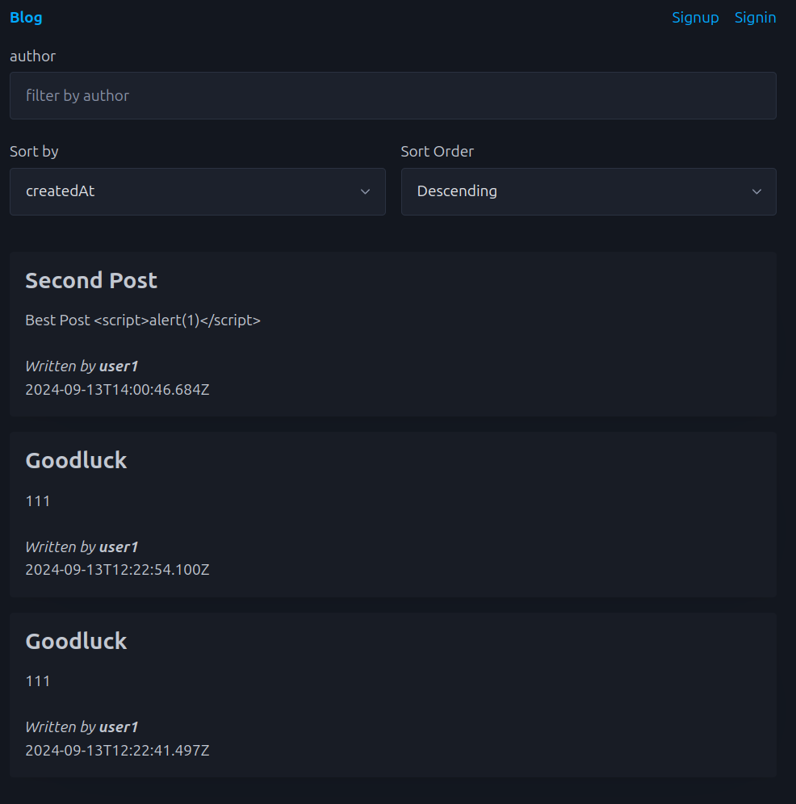

# Blog

## Tech Stack

- picocss
- tanstack query

## Functionality

### Blog Post

- View a single blog post
- Create a new blog post
- List all blog posts
- Filter blog posts
- Sort blog posts

### User

- Sign up
- Sign in
- Sign out

## Screenshots



## Run Locally

```bash
pnpm install
pnpm dev
```

## Backend

[express+mongodb](https://github.com/meirongdev/express_mongoose)
